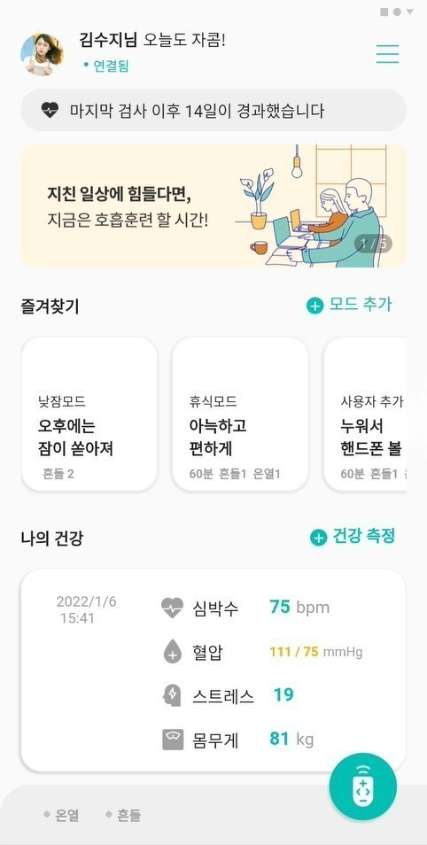
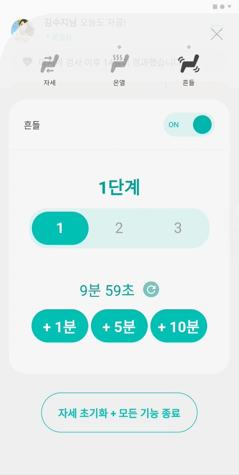
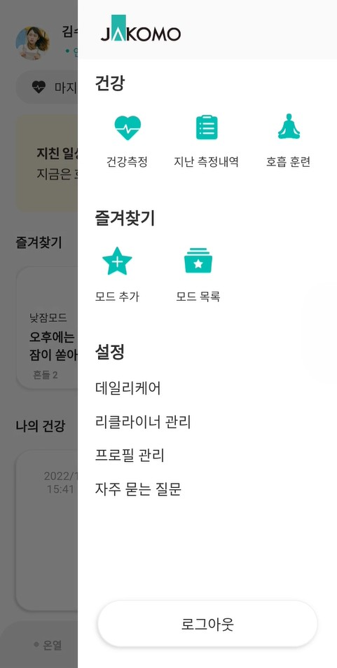
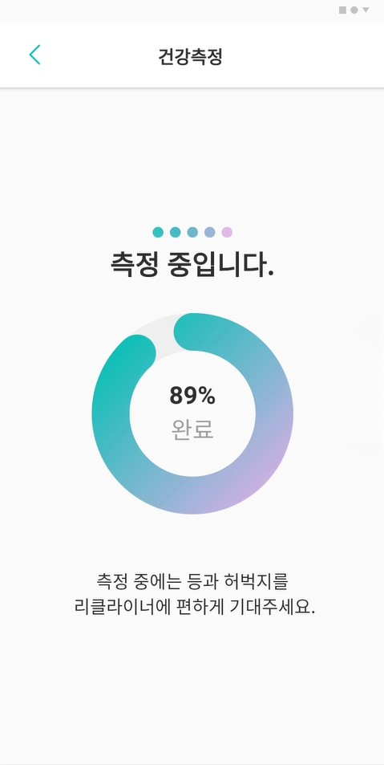
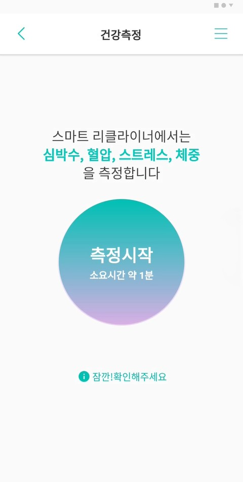
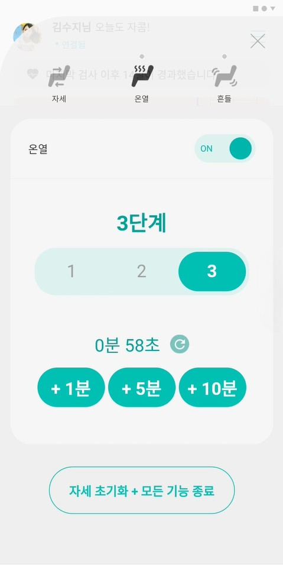
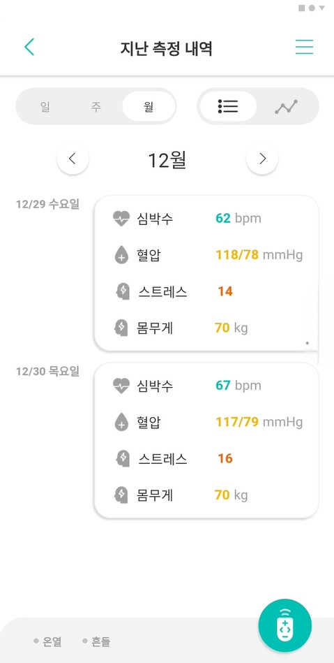
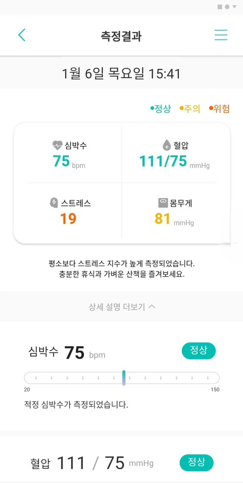
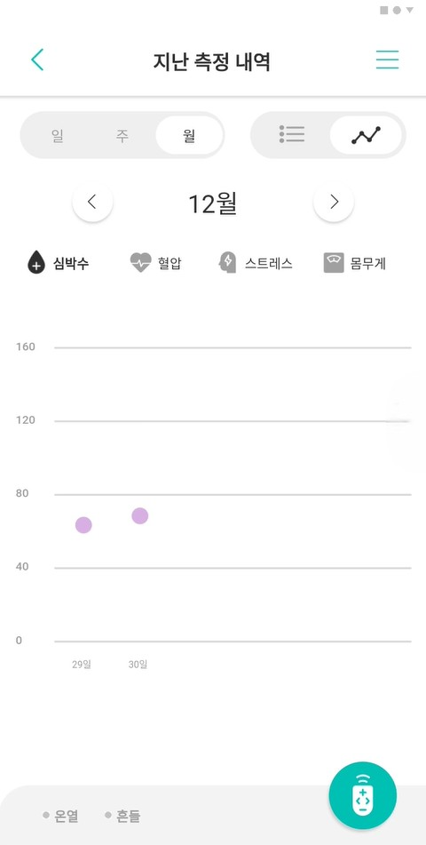
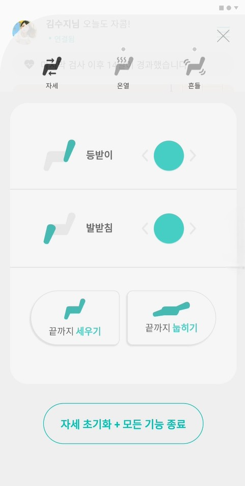

<h1 align="center">SmartRecliner Project</h1>  

<div align="center">
 


 
</div>

<table>
   <tr>
      <td>
         <a href="https://drive.google.com/file/d/1XkPu5-FzIulQEAY-mL7eNyhquiBI5qEj/view?usp=drive_link">
         
      </td>
      <td>
         <a href="https://drive.google.com/file/d/1XkPu5-FzIulQEAY-mL7eNyhquiBI5qEj/view?usp=drive_link">
         
      </td>
      <td>
         <a href="https://drive.google.com/file/d/1XkPu5-FzIulQEAY-mL7eNyhquiBI5qEj/view?usp=drive_link">
         
      </td>
      <td>
         <a href="https://drive.google.com/file/d/1XkPu5-FzIulQEAY-mL7eNyhquiBI5qEj/view?usp=drive_link">
         
      </td>
      <td>
         <a href="https://drive.google.com/file/d/1XkPu5-FzIulQEAY-mL7eNyhquiBI5qEj/view?usp=drive_link">
         
      </td>
      <td>
         <a href="https://drive.google.com/file/d/1XkPu5-FzIulQEAY-mL7eNyhquiBI5qEj/view?usp=drive_link">
         
      </td>      
   </tr>
   <tr>
      <td>
         <a href="https://drive.google.com/file/d/1XkPu5-FzIulQEAY-mL7eNyhquiBI5qEj/view?usp=drive_link">
         
      </td>      
      <td>
         <a href="https://drive.google.com/file/d/1XkPu5-FzIulQEAY-mL7eNyhquiBI5qEj/view?usp=drive_link">
         
      </td>
      <td>
         <a href="https://drive.google.com/file/d/1XkPu5-FzIulQEAY-mL7eNyhquiBI5qEj/view?usp=drive_link">
         
      </td>
      <td>
         <a href="https://drive.google.com/file/d/1XkPu5-FzIulQEAY-mL7eNyhquiBI5qEj/view?usp=drive_link">
         
      </td>
      <td>
         <a href="https://drive.google.com/file/d/1XkPu5-FzIulQEAY-mL7eNyhquiBI5qEj/view?usp=drive_link">
         
      </td>
    </tr>	
</table>

#### 👉🏻[앱 동영상](https://drive.google.com/file/d/1XkPu5-FzIulQEAY-mL7eNyhquiBI5qEj/view?usp=drive_link)


## 🥹 프로젝트 소개  
해당 프로젝트는 통칭 SmartRecliner 프로젝트로 https://github.com/kimtaeoug/jakomo 와 같은 프로젝트입니다. 하지만 해당 프로젝트는 협업 도중 기관들 간의 갈등으로 중단되었습니다.

### 🧑‍💻 프로젝트내 담당 업무  
+ 서비스 개발 -> Flutter를 사용한 앱 개발  

### 🙌 Contributing and Company    
> Emmahc : 서비스 설계 및 개발, 배포, 팀 리딩  
> 생산기술연구원 : 리클라이너 설계 Support   
> Jakomo : 리클라이너 제조 및 설계  
>  : 기획 및 디자인    

### Application 구조
<details><summary>ApplicationTree</summary>
   
```bash
├── README.md
├── android
│   ├── app
│   │   ├── build.gradle
│   │   └── src
│   │       ├── debug
│   │       │   └── AndroidManifest.xml
│   │       ├── main
│   │       │   ├── AndroidManifest.xml
│   │       │   ├── kotlin
│   │       │   │   └── com
│   │       │   │       └── example
│   │       │   │           └── smartrecliner_flutter
│   │       │   │               └── MainActivity.kt
│   │       │   └── res
│   │       │       ├── drawable
│   │       │       │   └── launch_background.xml
│   │       │       ├── drawable-v21
│   │       │       │   └── launch_background.xml
│   │       │       ├── mipmap-hdpi
│   │       │       │   └── ic_launcher.png
│   │       │       ├── mipmap-mdpi
│   │       │       │   └── ic_launcher.png
│   │       │       ├── mipmap-xhdpi
│   │       │       │   └── ic_launcher.png
│   │       │       ├── mipmap-xxhdpi
│   │       │       │   └── ic_launcher.png
│   │       │       ├── mipmap-xxxhdpi
│   │       │       │   └── ic_launcher.png
│   │       │       ├── values
│   │       │       │   └── styles.xml
│   │       │       └── values-night
│   │       │           └── styles.xml
│   │       └── profile
│   │           └── AndroidManifest.xml
│   ├── build.gradle
│   ├── gradle
│   │   └── wrapper
│   │       └── gradle-wrapper.properties
│   ├── gradle.properties
│   └── settings.gradle
├── images
│   ├── back_img.png
│   ├── banner1_img.png
│   ├── banner2_img.png
│   ├── ble_img.png
│   ├── blooddrop_black_img.png
│   ├── blooddrop_img.png
│   ├── body_controlseat_img.png
│   ├── breathe_mint_img.png
│   ├── check_img.png
│   ├── close_black_img.png
│   ├── close_img.png
│   ├── context_circle_img.png
│   ├── context_recten_img.png
│   ├── context_trialg_img.png
│   ├── directionsign_left_img.png
│   ├── directionsign_right_img.png
│   ├── down_direction_img.png
│   ├── dummy_profile.png
│   ├── graph_icon_black_img.png
│   ├── graph_icon_gray_img.png
│   ├── healthnodata_img.png
│   ├── heart_black_img.png
│   ├── heart_img.png
│   ├── heart_mint_img.png
│   ├── heartgrey_img.png
│   ├── heat_seat_grey_img.png
│   ├── heat_seat_img.png
│   ├── info_img.png
│   ├── jakomo_logo_img.png
│   ├── leg_controlseat_img.png
│   ├── list_black_img.png
│   ├── list_gray_img.png
│   ├── lying_img.png
│   ├── lying_white_img.png
│   ├── measure_next_history_img.png
│   ├── measure_previous_history_img.png
│   ├── menu_img.png
│   ├── mode_add_mint_img.png
│   ├── mode_list_mint_img.png
│   ├── playing_img.png
│   ├── plus_img.png
│   ├── point_grey_img.png
│   ├── point_img.png
│   ├── point_red_img.png
│   ├── point_yellow_img.png
│   ├── position_seat_grey_img.png
│   ├── position_seat_img.png
│   ├── progress_grey_img.png
│   ├── progress_original_img.png
│   ├── radial_scale.png
│   ├── remoter_img.png
│   ├── reset_grey_img.png
│   ├── reset_img.png
│   ├── result_mint_img.png
│   ├── rocking_seat_grey_img.png
│   ├── rocking_seat_img.png
│   ├── sit_img.png
│   ├── sit_white_img.png
│   ├── stress_black_img.png
│   ├── stress_img.png
│   ├── up_direction_img.png
│   ├── weight_black_img.png
│   └── weight_img.png
├── ios
│   ├── Flutter
│   │   ├── AppFrameworkInfo.plist
│   │   ├── Debug.xcconfig
│   │   └── Release.xcconfig
│   ├── Runner
│   │   ├── AppDelegate.swift
│   │   ├── Assets.xcassets
│   │   │   ├── AppIcon.appiconset
│   │   │   │   ├── Contents.json
│   │   │   │   ├── Icon-App-1024x1024@1x.png
│   │   │   │   ├── Icon-App-20x20@1x.png
│   │   │   │   ├── Icon-App-20x20@2x.png
│   │   │   │   ├── Icon-App-20x20@3x.png
│   │   │   │   ├── Icon-App-29x29@1x.png
│   │   │   │   ├── Icon-App-29x29@2x.png
│   │   │   │   ├── Icon-App-29x29@3x.png
│   │   │   │   ├── Icon-App-40x40@1x.png
│   │   │   │   ├── Icon-App-40x40@2x.png
│   │   │   │   ├── Icon-App-40x40@3x.png
│   │   │   │   ├── Icon-App-60x60@2x.png
│   │   │   │   ├── Icon-App-60x60@3x.png
│   │   │   │   ├── Icon-App-76x76@1x.png
│   │   │   │   ├── Icon-App-76x76@2x.png
│   │   │   │   └── Icon-App-83.5x83.5@2x.png
│   │   │   └── LaunchImage.imageset
│   │   │       ├── Contents.json
│   │   │       ├── LaunchImage.png
│   │   │       ├── LaunchImage@2x.png
│   │   │       ├── LaunchImage@3x.png
│   │   │       └── README.md
│   │   ├── Base.lproj
│   │   │   ├── LaunchScreen.storyboard
│   │   │   └── Main.storyboard
│   │   ├── Info.plist
│   │   └── Runner-Bridging-Header.h
│   ├── Runner.xcodeproj
│   │   ├── project.pbxproj
│   │   ├── project.xcworkspace
│   │   │   ├── contents.xcworkspacedata
│   │   │   └── xcshareddata
│   │   │       ├── IDEWorkspaceChecks.plist
│   │   │       └── WorkspaceSettings.xcsettings
│   │   └── xcshareddata
│   │       └── xcschemes
│   │           └── Runner.xcscheme
│   └── Runner.xcworkspace
│       ├── contents.xcworkspacedata
│       └── xcshareddata
│           ├── IDEWorkspaceChecks.plist
│           └── WorkspaceSettings.xcsettings
├── lib
│   ├── Api
│   │   ├── APIResultDto.dart
│   │   ├── ApiClient.dart
│   │   ├── ApiClient.g.dart
│   │   ├── ApiRawDto.dart
│   │   ├── ApiRawDto.g.dart
│   │   ├── DummyHistoryDto.dart
│   │   ├── DummyHistoryDto.g.dart
│   │   ├── HistoryAPI.dart
│   │   ├── HistoryAPI.g.dart
│   │   ├── HistoryApiResponse.dart
│   │   └── HistoryApiResponse.g.dart
│   ├── Banner
│   │   └── BannerUI.dart
│   ├── BleProvider.dart
│   ├── BleScan
│   │   └── BLEScanBlue.dart
│   ├── BottomUI.dart
│   ├── ChartGraph
│   │   ├── BloodPressureGraphUI.dart
│   │   ├── HistoryListUI.dart
│   │   └── ReclinerGraphUI.dart
│   ├── ContextMenu
│   │   └── ContextMenu.dart
│   ├── Control
│   │   ├── ControlAttributeUI.dart
│   │   ├── ControlHeatUI.dart
│   │   ├── ControlShakeUI.dart
│   │   ├── ControlUI.dart
│   │   ├── HeatMultiSwitch.dart
│   │   ├── HeatProvider.dart
│   │   ├── RemoteContolProvider.dart
│   │   ├── ShakeMultiSwitch.dart
│   │   └── ShakeProvider.dart
│   ├── Drawer
│   │   └── DrawerUI.dart
│   ├── Dto
│   │   └── MeasureResultDto.dart
│   ├── Health
│   │   ├── HealthItemUI.dart
│   │   └── HistoryHealthItemUI.dart
│   ├── History
│   │   ├── DummyHistory.dart
│   │   ├── History.dart
│   │   ├── HistoryBloodPressureGraphUI.dart
│   │   ├── HistoryDateController.dart
│   │   ├── HistoryGraphController.dart
│   │   ├── HistoryGraphUI.dart
│   │   ├── HistoryList.dart
│   │   ├── HistoryListItem.dart
│   │   ├── HistoryProvider2.dart
│   │   ├── NewHistoryGraphUI.dart
│   │   ├── NewHistoryProvider.dart
│   │   └── TestProvider.dart
│   ├── HistoryRestAPI
│   │   ├── ApiResultDto.dart
│   │   ├── ApiResultDto.g.dart
│   │   ├── HApi.dart
│   │   ├── HApi.g.dart
│   │   ├── HApiInfoDto.dart
│   │   ├── HApiInfoDto.g.dart
│   │   ├── HApiInsertDto.dart
│   │   ├── HApiInsertDto.g.dart
│   │   ├── HApiResultDto.dart
│   │   ├── HApiResultDto.g.dart
│   │   ├── OnlyUserEmailDto.dart
│   │   ├── OnlyUserEmailDto.g.dart
│   │   ├── UserEmailDto.dart
│   │   └── UserEmailDto.g.dart
│   ├── MainPage.dart
│   ├── Measure
│   │   ├── DetailResult.dart
│   │   ├── HistoryControlDate.dart
│   │   ├── HistoryProvider.dart
│   │   ├── HistroyControlGraph.dart
│   │   ├── Measure.dart
│   │   ├── MeasureGraphUI.dart
│   │   ├── MeasureHistory.dart
│   │   ├── MeasureResult.dart
│   │   ├── Measuring.dart
│   │   └── ProcessRawData.dart
│   ├── MemberShip
│   │   ├── MemberShipStart.dart
│   │   └── PatternAuth.dart
│   ├── Mode
│   │   ├── ModeDto.dart
│   │   └── ModeItemUI.dart
│   ├── Protocol
│   │   └── BleProtocol.dart
│   ├── SplashPage.dart
│   ├── UISupport
│   │   ├── AppbarUI.dart
│   │   ├── CustomDialogBox.dart
│   │   ├── ModeData.dart
│   │   ├── ReclinerColor.dart
│   │   └── ScreenUtilAPI.dart
│   └── main.dart
├── pubspec.lock
├── pubspec.yaml
└── test
    └── widget_test.dart
``` 
   
</details>
